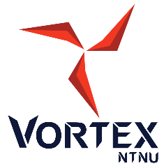
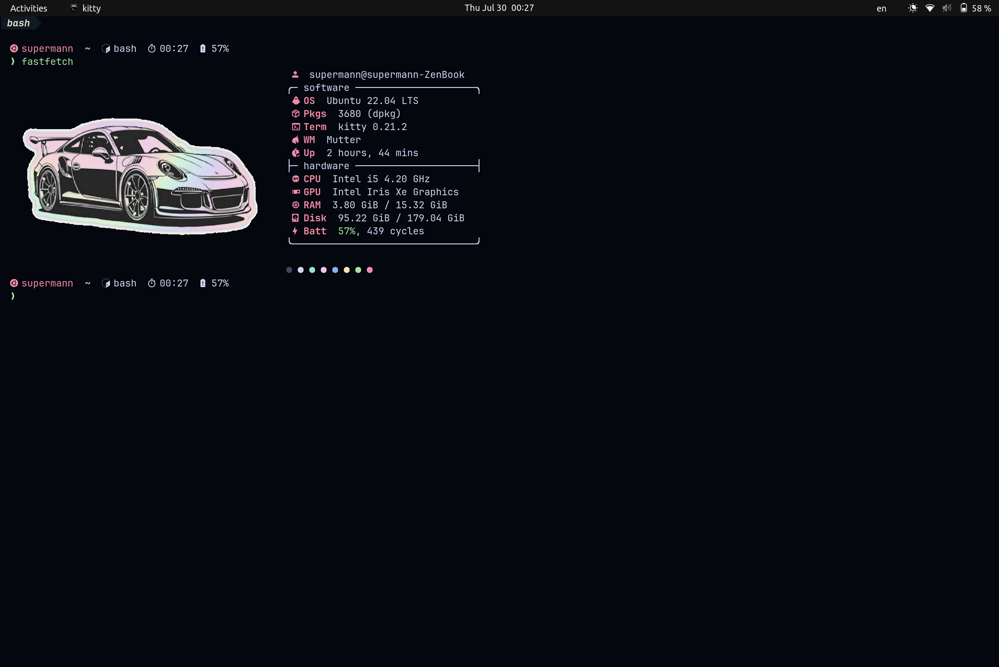
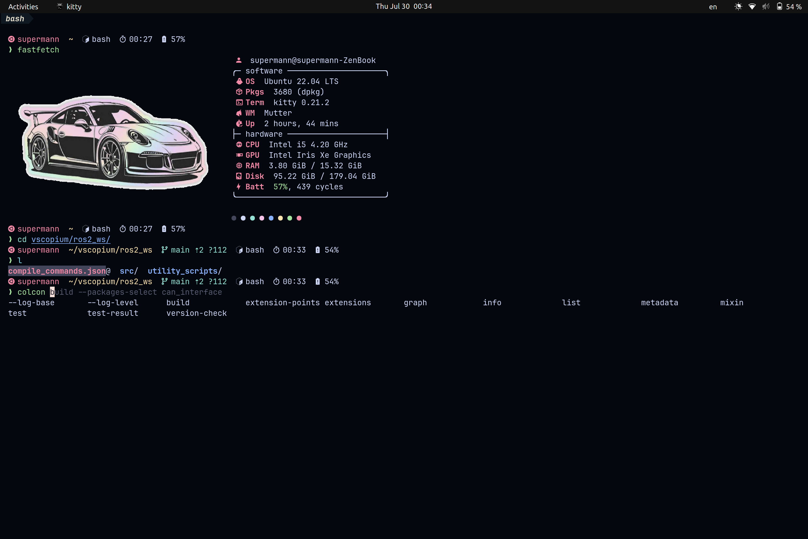
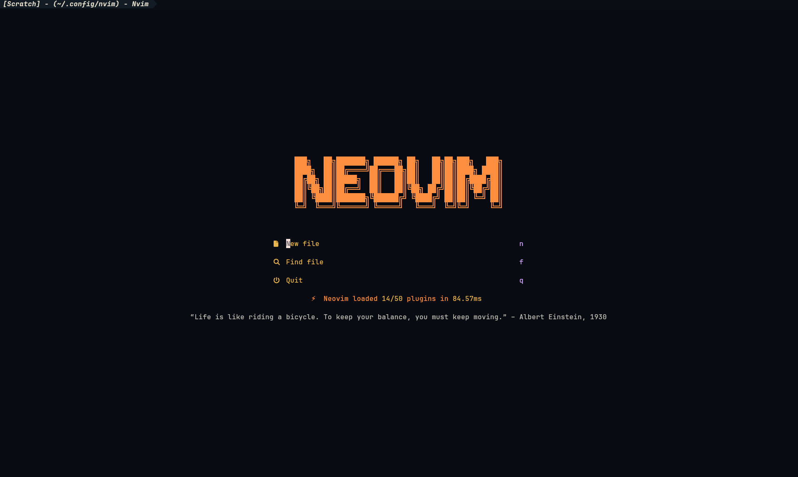
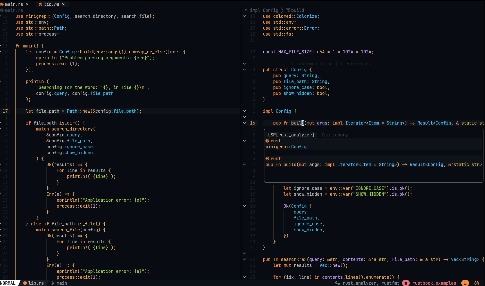
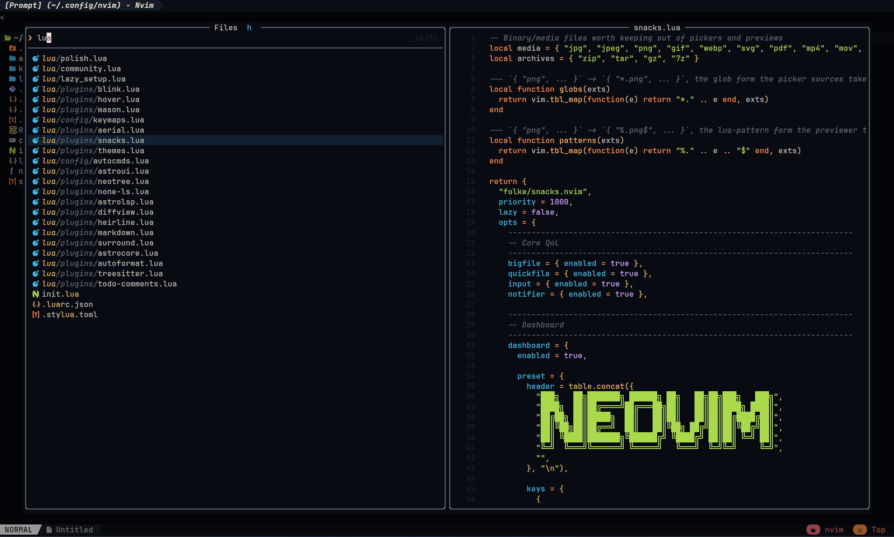
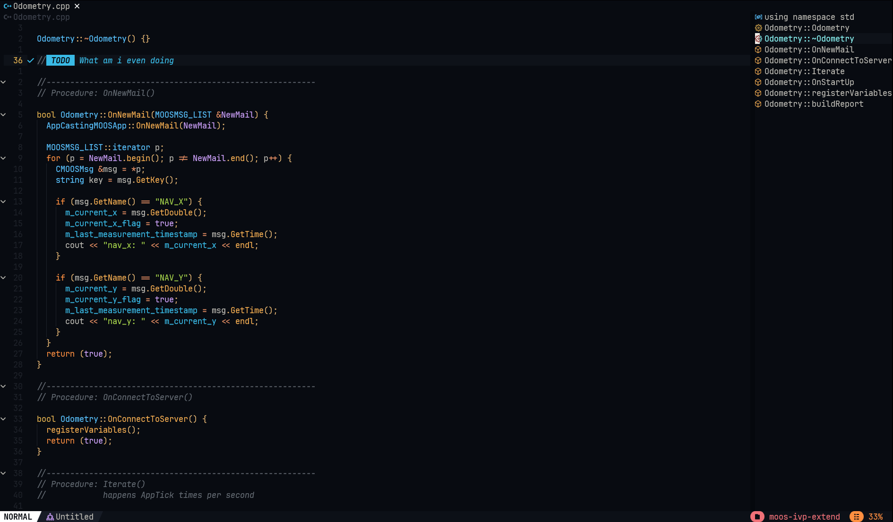

<div align="center">



# Ubuntu Onboarding Installer

**Fresh Ubuntu ISO to a fully configured development environment, in one command.**

Ubuntu 26.04 · stock GNOME · ROS 2 Lyrical Luth

</div>

---

## Before you start: the checklist

Work through this list first. The installer checks items 1 and 3 itself and
refuses to run if either is missing, so getting them right now saves you a
failed run later.

| # | You need | How to check | If you don't have it |
|---|---|---|---|
| 1 | **Ubuntu 26.04**, freshly installed | `lsb_release -r` prints `26.04` | [Step 0](#step-0-install-ubuntu-first) below |
| 2 | **An account with sudo** | `sudo true` succeeds | Use the account you created during Ubuntu setup |
| 3 | **A working GitHub SSH key** | `ssh -T git@github.com` greets you by username | [GitHub's SSH guide](https://docs.github.com/en/authentication/connecting-to-github-with-ssh) |
| 4 | **Membership of the `vortexntnu` GitHub org** | You can open [vortex-auv](https://github.com/vortexntnu/vortex-auv) | Ask in the `#software` channel |
| 5 | **A wired or stable connection, and time** | | Budget 20 to 30 minutes, or 60 to 90 with ROS 2 |
| 6 | **Nothing precious in your home directory** | | This is meant for a fresh install. Existing files are backed up, not deleted, but don't test that on your only copy |

### On the SSH key

This is the one people get stuck on, so to be explicit: **the installer does not
set up your SSH key for you.** It checks that you already have a working one and
stops if you don't.

That is deliberate. Everything worth installing here lives behind a
`git@github.com` remote, and several VortexNTNU repositories are private. An
installer that shrugged and cloned over HTTPS would hand you a half-empty
workspace and a build that fails an hour later for reasons that look nothing
like the actual cause.

Your key is working when this prints your username:

```bash
ssh -T git@github.com
# Hi <your-username>! You've successfully authenticated, but GitHub does not provide shell access.
```

If it doesn't, follow GitHub's guide start to finish. It covers generating the
key, adding it to the agent, and registering it on your account:

**https://docs.github.com/en/authentication/connecting-to-github-with-ssh**

Item 4 matters separately. A key that authenticates fine still can't clone a
private repository you have no access to, and that failure shows up as a
handful of skipped repos near the end of the ROS 2 stage.

---

## Step 0: install Ubuntu first

**Before you run anything in this repo, you need Ubuntu on the machine.**

> 📖 **Read the VortexNTNU wiki guide first:**
> **[Getting started (Software)](https://vortex.a2hosted.com/index.php/Getting_started_(Software))**
>
> It covers making the bootable USB, shrinking your Windows partition, the
> partition layout to use, and the dual-boot bootloader setup. Don't skip it.
> Repartitioning a disk incorrectly loses data, and this installer can't help
> you with that part.

Come back here once you have booted into a working Ubuntu desktop.

> [!IMPORTANT]
> **This installer targets Ubuntu 26.04 only.** ROS 2 Lyrical Luth pairs with
> 26.04 "Resolute". On any other release the installer refuses to run rather
> than half-working, so install 26.04 before you continue.

---

## Quick start

```bash
sudo apt update && sudo apt install -y git
git clone https://github.com/Q3rkses/ubuntu_setup_script.git ~/ubuntu_setup_script
cd ~/ubuntu_setup_script
./install.sh
```

Answer the handful of questions and leave it running. Expect about 20 to 30
minutes, or 60 to 90 if you include ROS 2. The `colcon build` at the end is the
slow part.

You will be asked for your sudo password once, at the start.

---

## What it asks you

| Question | Options | Effect |
|---|---|---|
| Your full name | free text | `git config --global user.name`, welcome banner |
| Profile | `vortex` / `personal` | vortex always installs ROS 2; personal adds Rust and lets you pick your own splash image |
| ROS 2? | yes / no | personal profile only, since the vortex profile always installs it |
| Editor | `nvim` / `vscode` | Neovim pulls in the full custom config |
| Browser | `chrome` / `vivaldi` / `firefox` | installed from the vendor's own apt repo |
| Splash image | path or URL | personal profile only |
| Git email | free text, optional | `git config --global user.email` |

### Running it unattended

Every prompt has a matching flag, so the whole thing works in CI or over SSH:

```bash
./install.sh --name "Ada Lovelace" --profile=vortex \
             --editor=nvim --browser=chrome --yes
```

<details>
<summary><b>All flags</b></summary>

```
--name "First Last"        Full name (git config + welcome banner)
--email you@example.com    Git email
--profile=vortex|personal  Which profile to install
--ros / --no-ros           Install ROS 2 (personal profile only)
--skip-ros-build           Install ROS 2 but stop before rosdep and colcon
--skip-ssh-check           Skip the GitHub SSH precondition, clone over HTTPS
                           (automated testing only)
--editor=nvim|vscode       Editor to install
--browser=chrome|vivaldi|firefox
--logo=PATH|URL            Personal-profile fastfetch splash image
--wallpaper=slideshow|static|none
                           Desktop wallpaper (personal profile)
--yes, -y                  Non-interactive: accept defaults, never prompt
--resume                   Skip stages already recorded as complete
--dry-run                  Print what would happen; change nothing
--only=STAGE[,STAGE...]    Run only these stages (e.g. --only=ros2)
--list-stages              Print stage names and their completion status
--help, -h                 Help
```

</details>

---

## What it installs, in order

The installer runs thirteen stages. Every one is idempotent, so running it again
is safe, and every one is checkpointed, so a failure never costs you the stages
that already succeeded.

### 1. `apt-upgrade`: system update
`apt update && apt upgrade -y`. Everything else assumes a current system.

### 2. `base-packages`: foundations
Build tooling (`build-essential`, `cmake`, `ninja-build`, `pkg-config`), CLI
essentials (`fzf`, `ripgrep`, `fd`, `ranger`, `jq`, `wl-clipboard`), the
JetBrainsMono Nerd Font, the starship prompt, and the `wofi` launcher.

> The Nerd Font isn't optional. Without it the fastfetch splash, the starship
> prompt and Neovim's status line all render as rows of ▯ boxes.

### 3. `toolchain`: GCC 13
Installs `gcc-13` and `g++-13` from the Ubuntu 26.04 archive and makes them the
system default through `update-alternatives`. No PPA is involved.

> **Why 13 and not "newest"?** Because "newest" isn't reproducible. Two people
> installing a month apart would get different compilers, and Vortex is a C++
> codebase where that matters. The version is a single named constant in
> `lib/toolchain.sh`, so bump it deliberately rather than by accident.

### 4. `cxx-libs`: Eigen and CasADi
The two C++ maths libraries Vortex code is built on. They are installed
differently, and the difference is deliberate.

**Eigen** comes from apt (`libeigen3-dev`, currently 3.4.0). It is header-only,
and more importantly it is the exact build every ROS 2 package in the archive
was compiled against. A second Eigen in `/usr/local` wins the CMake search and
leaves half your packages compiled against one version and their dependencies
against another. That shows up as random segfaults, not build errors, so the
installer checks for a stray copy and warns you about it.

**CasADi** is built from source, pinned to a version named in `lib/cxxlibs.sh`.
The apt package works, but Debian strips the vendored solvers out of it:

| In the apt build | Missing from it |
|---|---|
| `nlpsol_ipopt`, `sqpmethod`, `scpgen`, `qrsqp` | `conic_osqp`, `conic_qpoases` |
| `conic_qrqp`, `conic_ipqp` | `integrator_cvodes`, `integrator_idas` (SUNDIALS) |
| `integrator_rk`, `integrator_collocation` | the HSL linear solvers |

Code asking for `cvodes` or `osqp` compiles against the apt build perfectly and
then fails at *runtime* with a plugin-not-found error, typically an hour into a
mission test. The source build enables IPOPT (from apt), plus CasADi's own
bundled SUNDIALS, OSQP and qpOASES, and then compiles and runs a test program
that actually loads all three plugins before calling the stage done.

Budget 10 to 20 minutes. The stage is soft, so a failed build costs you nothing
else, and the result is stamped so a re-run is instant:

```bash
./install.sh --only=cxx-libs
```

### 5. `git-config`: git identity
Sets your git name, email, default branch, rebase-on-pull and editor.

Note what this stage does *not* do: it does not touch SSH. A working GitHub key
is checked once, before any stage runs, and a missing one stops the installer
outright. See [the checklist](#before-you-start-the-checklist).

### 6. `shortcuts`: GNOME keybindings
| Shortcut | Action |
|---|---|
| `Super` + `1` … `4` | Switch to workspace 1 to 4 |
| `Super` + `Shift` + `1` … `4` | Move the current window to workspace 1 to 4 |
| `Super` + `Enter` | New Kitty terminal |
| `Super` + `Q` | Close the focused window |
| `Super` + `R` | Wofi application launcher |
| `Super` + `↑` / `↓` | Maximise / unmaximise |

Workspaces are switched to static, fixed at 4, and GNOME's conflicting `Super+N`
"switch to application" bindings are cleared.

> [!NOTE]
> **Your existing keybindings are backed up first.** A full `dconf dump
> /org/gnome/` is written to `~/.local/state/vortex-onboarding/backups/` before
> anything changes. Restore it with:
> ```bash
> dconf load /org/gnome/ < ~/.local/state/vortex-onboarding/backups/dconf-gnome-<timestamp>.ini
> ```
> The stage also prunes orphaned custom-keybinding entries. Those are empty
> schema stubs left behind by previous dconf imports, and they otherwise break
> the Settings UI silently.

### 7. `bashrc`: shell configuration
Installs the managed `.bashrc` and `.bash_aliases`, backing up whatever was
there, installs NVM, and creates `~/code/ros2_ws`.

Aliases and helpers you get:

| Command | Does |
|---|---|
| `cb <pkg>` | `colcon build --packages-up-to <pkg>` with testing on |
| `ct <pkg>` | `colcon test` for a package, console output direct |
| `s` | `source install/setup.bash` |
| `rcd` | `ranger`, but your shell ends up in the directory you chose |
| `ll`, `la`, `l` | the usual `ls` variants |

It also installs **ble.sh**, which gives bash inline autosuggestions, roughly
what PowerShell's predictive IntelliSense does:

- A grey suggestion appears ahead of your cursor, taken from history. Press `→`
  or `End` to accept all of it, `Alt+F` for one word at a time.
- `Tab` opens a navigable menu with the matched text highlighted, instead of
  dumping a plain column list.

Syntax highlighting is on, but deliberately restrained. The rule is to colour
only what tells you something you didn't already know.

| Coloured | Why |
|---|---|
| syntax errors, bad flags, missing paths | red, so you see the mistake before pressing Enter |
| `"quoted strings"` | yellow, showing where the string really ends |
| `$VAR`, `${EXPANSION}` | mauve, so you can spot an expansion at a glance |
| real directories | blue and underlined, confirming the path exists |
| `# comments` | dim, so they recede |
| the inline suggestion | grey, because it isn't text you typed |

**Command words are left uncoloured.** ble.sh's stock theme paints commands
brown, builtins red, strings green and executables green, so nearly every line
starts green and the colour tells you nothing. Everything is set explicitly in
`~/.blerc`, which also means an upstream default change can't quietly bring it
back.

To go back to the stock theme, delete the `ble-face` lines from `~/.blerc`. To
turn highlighting off completely, set `highlight_syntax=`, `highlight_filename=`
and `highlight_variable=` to empty.

> **Startup time is deliberately protected.** NVM and conda are lazy-loaded,
> defined as stub functions that replace themselves on first call, and the ROS,
> Cargo and colcon sourcing is all guarded by existence checks. An interactive
> shell stays around 200 ms instead of the ~1 s an eager config costs.

### 8. `kitty-fastfetch`: terminal
Kitty with the Catppuccin Mocha theme, and fastfetch configured to print a
system summary with a logo rendered through Kitty's graphics protocol.

The logo depends on your profile: the Vortex mark for `vortex`, the GT3 RS
sticker for `personal`, or your own image if you supplied one.

fastfetch runs only for the *first* Kitty window, so opening a second tab
doesn't reprint the whole banner.

### 9. `wallpaper`: desktop background (personal profile only)
A rotating slideshow of four Porsche 911 GT3 RS wallpapers, to match the GT3 RS
terminal splash. A GNOME slideshow XML rotates them every 30 minutes with a
5-second cross-fade, and the set registers itself in **Settings → Appearance**
so you can also pick it by hand.

Images are staged into `~/.local/share/backgrounds/vortex-onboarding/`, outside
the repo, so deleting your clone doesn't blank the desktop.

Light and dark mode are both set, as is the lock screen, so the background
doesn't revert when the theme switches.

```bash
--wallpaper=slideshow   # default: all four, rotating
--wallpaper=static      # just the first image
--wallpaper=none        # leave the wallpaper alone
```

> **The vortex profile never touches your wallpaper.** New members get whatever
> Ubuntu shipped with, since they didn't sign up for somebody else's taste in
> cars. Your previous wallpaper setting is saved to
> `~/.local/state/vortex-onboarding/backups/` before anything changes.

### 10. `editor`: Neovim or VS Code
**Neovim** comes from the official release tarball, because the Ubuntu archive
version is too old for a modern config. Then `Q3rkses/nvimconf` is cloned to
`~/.config/nvim` and plugins are synced headlessly, so your first real launch is
instant instead of a three-minute plugin download.

**VS Code** comes from Microsoft's apt repository, never the snap. Having both
of them fighting over updates is a mess you only debug once.

### 11. `browser`: Chrome, Vivaldi or Firefox
All three come from the vendor's official apt repo. For Firefox that means an
apt pin which beats Ubuntu's transitional package, so you get the real `.deb`
and not the snap.

### 12. `rust` (personal profile only)
`rustup` with the stable toolchain plus `rust-analyzer`, `clippy` and `rustfmt`.
It uses rustup rather than apt so you can pin and switch toolchains later.

### 13. `ros2`: ROS 2 Lyrical Luth, deliberately last
Installs `ros-lyrical-desktop` and the dev tooling, adds YASMIN, creates
`~/code/ros2_ws/src`, clones the eight Vortex repositories, drops in the utility
scripts, resolves dependencies with `rosdep`, and builds with `colcon`.

**YASMIN** is the finite state machine library mission logic is written against.
Three packages come from the ROS apt index rather than the workspace, so they
get security updates with everything else and don't lengthen your colcon build:

| Package | What it gives you |
|---|---|
| `ros-lyrical-yasmin` | the state machine core |
| `ros-lyrical-yasmin-ros` | ROS 2 integration: action, service and topic states |
| `ros-lyrical-yasmin-viewer` | the web UI that draws the running state machine, which is the fastest way to see why a mission is stuck |

A package not yet released for Lyrical is reported as a warning and skipped, not
treated as a failure.

| Repository | Branch |
|---|---|
| `vortex-auv` | `development` |
| `vortex-msgs` | `main` |
| `vortex-utils` | `main` |
| `vortex-ci` | `main` |
| `stonefish_ros2` | `main` |
| `vortex-stonefish-interface` | `main` |
| `vortex-stonefish-sim` | `main` |
| `stim300-driver` | `feature/ros2-port` |

> **This stage is last because it's the one most likely to fail.** It's a 30 to
> 60 minute compile against a large dependency tree. If it breaks, everything
> else is already installed and checkpointed, so you only re-run this one stage:
> ```bash
> ./install.sh --only=ros2
> ```
> The full build log is at `~/.local/state/vortex-onboarding/logs/colcon-build.log`.

---

## When something fails

The installer tells you which stage failed and how to resume. In short:

```bash
./install.sh --list-stages     # what's done, what isn't
./install.sh --resume          # carry on, skipping completed stages
./install.sh --only=ros2       # retry one stage
./install.sh --dry-run         # see what it would do, change nothing
```

Logs: `~/.local/state/vortex-onboarding/logs/`
Backups: `~/.local/state/vortex-onboarding/backups/`
State: `~/.local/state/vortex-onboarding/install_state`

The `cxx-libs`, `shortcuts`, `kitty-fastfetch`, `wallpaper`, `editor`, `browser`,
`rust` and `ros2` stages are **soft**. If one of them fails the installer reports
it and carries on with the rest, instead of leaving you with a half-configured
machine.

The two preconditions are the opposite: an unsupported Ubuntu release or a
GitHub SSH key that doesn't authenticate stops the installer before it changes
anything at all.

---

## Verifying your install

**First, log out and log back in.** GNOME keyboard shortcuts and your new shell
environment only apply to a fresh session. This is the single most common reason
someone reports that the shortcuts didn't work.

Then run the automated checks:

```bash
cd ~/ubuntu_setup_script
./tests/verify_install.sh
```

Every applicable row should say `PASS`. Rows for the profile you didn't choose
say `SKIP`.

---

## What it should look like

### Terminal

Kitty on first launch, showing the fastfetch splash with the logo drawn as a
real image through Kitty's graphics protocol, and the starship prompt beneath
it. This is what `Super+Enter` should give you:



Completions in action. There are two separate things visible here:



- The grey text after `colcon b`, reading `build --packages-select
  can_interface`, is ble.sh predicting from history. Press `→` or `End` to
  accept it.
- The list underneath is the Tab completion menu, filtered as you type.
- Notice `vscopium/ros2_ws/` in blue underline on the `cd` line. That's the
  `filename_directory` face confirming the path really exists, while the command
  words themselves stay uncoloured, which is deliberate.

### Neovim

The dashboard on `nvim` with no arguments:



Editing, with LSP diagnostics and the status line:



The file picker:



Outline and TODO comments:



### Then check these by hand

The script can't press keys for you, so confirm these yourself:

- [ ] **`Super` + `Enter`** opens a Kitty window
- [ ] That window shows the fastfetch splash with the logo drawn as an actual
      image, not ASCII art and not ▯ boxes. Compare it with the screenshot above.
- [ ] The prompt is the starship prompt with icons: a distro logo, the
      directory, and a git branch symbol when you're inside a repo
- [ ] **`Super` + `2`** switches to workspace 2, and **`Super` + `1`** comes back
- [ ] With a window focused, **`Super` + `Shift` + `3`** moves it to workspace 3
- [ ] **`Super` + `Q`** closes the focused window
- [ ] **`Super` + `R`** opens the Wofi launcher
- [ ] `nvim` opens with your config, plugins load, and there's no error banner
      on startup
- [ ] `gcc --version` reports 13.x
- [ ] CasADi resolves the plugins the apt build lacks:
      ```bash
      cat > /tmp/c.cpp <<'EOF'
      #include <casadi/casadi.hpp>
      #include <Eigen/Dense>
      int main() {
          casadi::SX t = casadi::SX::sym("t");
          casadi::integrator("i", "cvodes", casadi::SXDict{{"x", t}, {"ode", -t}}, 0, 1);
          casadi::conic("q", "osqp", casadi::SpDict{{"h", casadi::Sparsity::dense(1, 1)}});
          Eigen::Matrix2d m; m << 1, 2, 3, 4;
          return m.determinant() == -2 ? 0 : 1;
      }
      EOF
      g++ -std=c++17 /tmp/c.cpp -I/usr/include/eigen3 -lcasadi -o /tmp/c && /tmp/c && echo OK
      ```
- [ ] Your browser launches from the Activities overview
- [ ] Personal profile only: the desktop background is a GT3 RS
- [ ] Personal profile only: `cargo --version` works
- [ ] With ROS: `ros2 doctor` reports no errors, and
      `ros2 run demo_nodes_cpp talker` prints messages
- [ ] With ROS: YASMIN is importable, `python3 -c "import yasmin, yasmin_ros"`,
      and `ros2 run yasmin_viewer yasmin_viewer_node` starts the web viewer

---

## Repository layout

```
onboarding/
├── install.sh                 entrypoint and stage orchestration
├── lib/
│   ├── common.sh              logging, checkpointing, idempotency helpers
│   ├── prompts.sh             argument parsing and interactive Q&A
│   ├── base.sh                apt upgrade, base packages, font, starship
│   ├── toolchain.sh           GCC 13
│   ├── cxxlibs.sh             Eigen (apt) and CasADi (source build)
│   ├── ssh_github.sh          GitHub SSH precondition and git identity
│   ├── shortcuts.sh           GNOME keybindings
│   ├── bashrc.sh              shell configuration and ble.sh
│   ├── kitty_fastfetch.sh     terminal and splash
│   ├── wallpaper.sh           desktop background (personal profile)
│   ├── nvim.sh                editor (Neovim or VS Code)
│   ├── browser.sh             Chrome / Vivaldi / Firefox
│   ├── rust.sh                rustup (personal profile)
│   └── ros2.sh                ROS 2 Lyrical (deferred to last)
├── dotfiles/                  the actual .bashrc, aliases, kitty, fastfetch, blerc
├── assets/logos/              Vortex mark, GT3 RS sticker
├── assets/wallpapers/         GT3 RS desktop backgrounds
├── assets/screenshots/        README images
├── tests/verify_install.sh    post-install verification
├── tests/docker/              container test harness
└── CHANGELOG.md
```

---

## Testing changes

A container harness runs the installer on a real Ubuntu image, which catches the
class of bug that only appears on a bare machine:

```bash
./tests/docker/run.sh                    # 26.04, vortex profile
./tests/docker/run.sh --profile personal
./tests/docker/run.sh --shell            # poke around inside instead
```

It covers apt, the GCC pin, dotfiles, the editor, the browser, rustup and the
ROS 2 apt setup. It can't cover the GNOME stages, because a container has no
session bus, so `shortcuts` and `wallpaper` abort there by design. Test those on
real hardware or in a VM.
